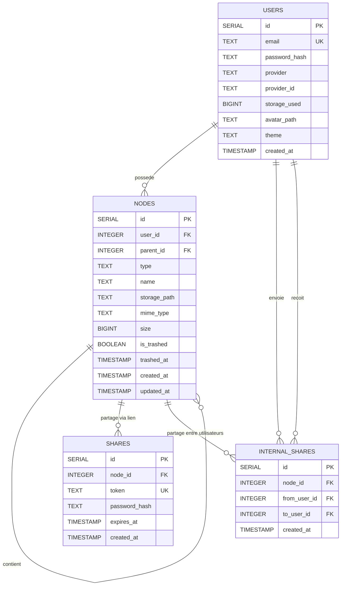
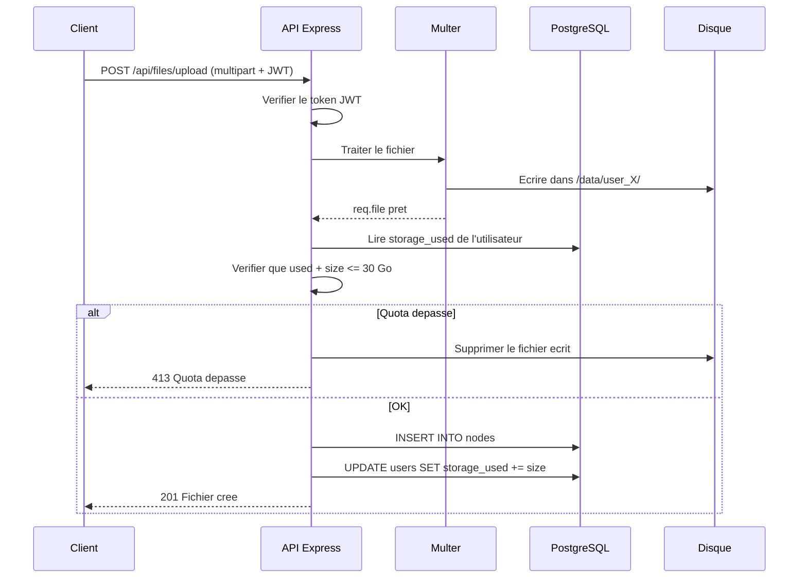
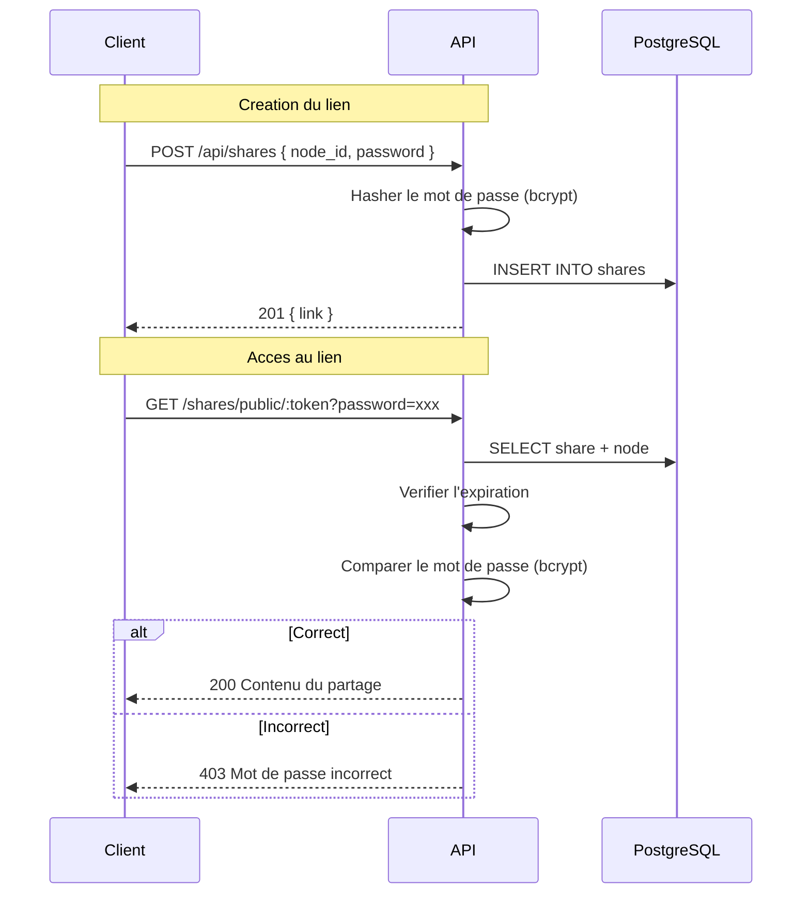
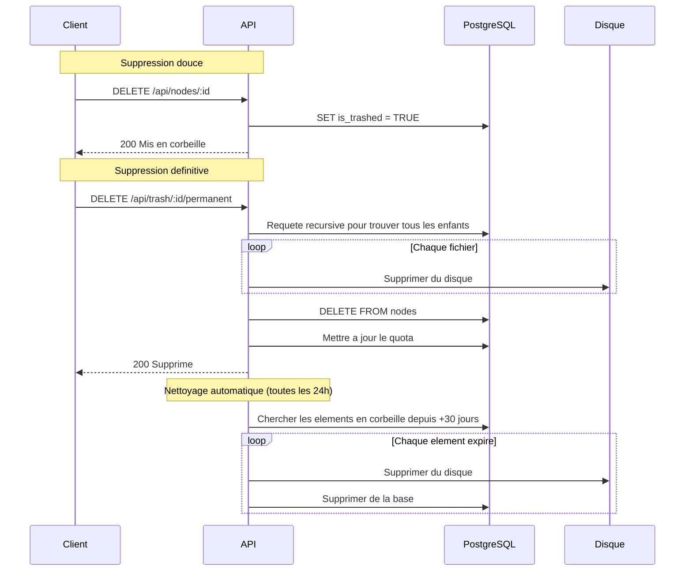

# SUPFile - Diagrammes UML

Ce document contient les diagrammes du projet au format Mermaid. Ils sont renderables directement sur GitHub, GitLab, ou dans n'importe quel viewer Markdown compatible Mermaid.

---

## Diagramme de cas d'utilisation

Le systeme a deux types d'acteurs : l'utilisateur connecte (qui a un compte) et le visiteur (qui accede a un lien de partage public sans compte).

```mermaid
flowchart LR
    subgraph Acteurs
        U[Utilisateur connecte]
        V[Visiteur via lien public]
    end

    subgraph Authentification
        A1[S'inscrire par email]
        A2[Se connecter par email]
        A3[Se connecter via Google]
        A4[Se deconnecter]
    end

    subgraph Gestion des fichiers
        F1[Uploader un ou plusieurs fichiers]
        F3[Creer un dossier]
        F4[Renommer un element]
        F5[Deplacer un element]
        F6[Supprimer vers la corbeille]
        F7[Naviguer dans les dossiers]
        F8[Rechercher par nom avec filtres]
    end

    subgraph Previsualisation
        P1[Voir une image]
        P2[Voir un PDF]
        P3[Lire un fichier texte ou Markdown]
        P4[Ecouter un fichier audio]
        P5[Regarder une video]
    end

    subgraph Telechargement
        D1[Telecharger un fichier]
        D2[Telecharger un dossier en ZIP]
    end

    subgraph Partage
        S1[Generer un lien public]
        S2[Proteger un lien par mot de passe]
        S3[Definir une expiration sur un lien]
        S4[Partager avec un utilisateur par email]
        S5[Consulter les fichiers partages avec moi]
    end

    subgraph Corbeille
        T1[Voir la corbeille]
        T2[Restaurer un element]
        T3[Supprimer definitivement]
        T4[Vider la corbeille]
    end

    subgraph Parametres
        C1[Changer son email]
        C2[Changer son mot de passe]
        C3[Modifier son avatar]
        C4[Changer le theme clair/sombre]
        C5[Supprimer son compte]
    end

    subgraph Dashboard
        DB1[Consulter le quota de stockage]
        DB2[Voir la repartition par type]
        DB3[Voir les fichiers recents]
    end

    U --> A1 & A2 & A3 & A4
    U --> F1 & F3 & F4 & F5 & F6 & F7 & F8
    U --> P1 & P2 & P3 & P4 & P5
    U --> D1 & D2
    U --> S1 & S2 & S3 & S4 & S5
    U --> T1 & T2 & T3 & T4
    U --> C1 & C2 & C3 & C4 & C5
    U --> DB1 & DB2 & DB3

    V --> D1
    V --> P1 & P2 & P3 & P4 & P5
```

---

## Schema de la base de donnees

Les 4 tables et leurs relations. La table `nodes` utilise une auto-reference (`parent_id`) pour modeliser l'arborescence de fichiers.

---

## Sequence : upload d'un fichier

Ce diagramme montre ce qui se passe quand un utilisateur uploade un fichier, de la requete HTTP jusqu'a l'ecriture sur disque et en base.

---

## Sequence : partage public avec mot de passe

---

## Sequence : suppression et corbeille

